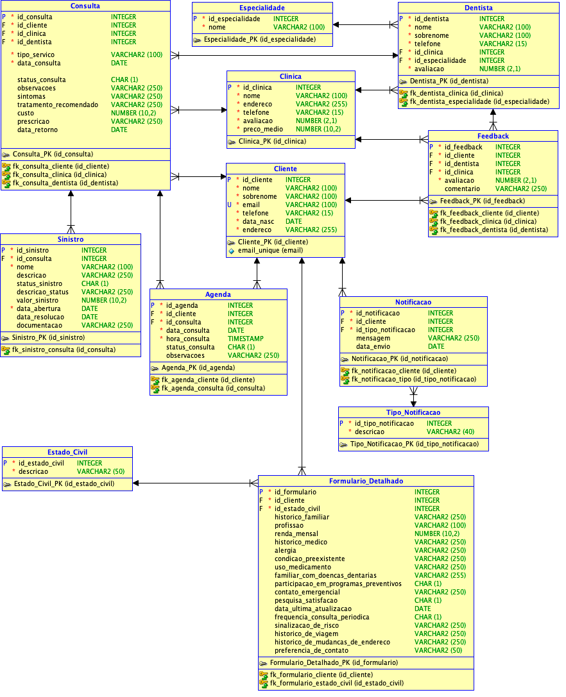
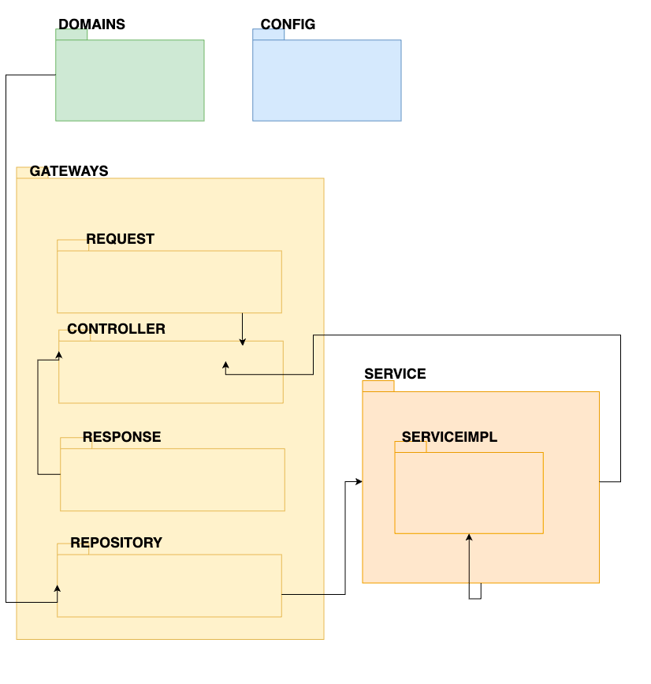
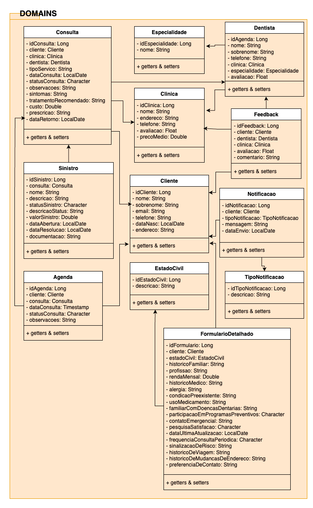

# **Challenge OdontoPrev**

    

## 📌 **Índice**
1. [Sobre o Projeto](#sobre-o-projeto)  
2. [Integrantes](#integrantes)  
3. [Cronograma de Desenvolvimento](#cronograma-de-desenvolvimento)  
4. [Atualização Sprint 3](#atualização-sprint-3)  
5. [Como Rodar o Projeto](#como-rodar-o-projeto)  
6. [Pré-requisitos](#pré-requisitos)  
7. [Modelo Relacional (DER)](#modelo-relacional-der)  
8. [Diagrama de Classes](#diagrama-de-classes)  
9. [Documentação da API](#documentação-da-api)  
10. [Vídeo Demonstrativo](#vídeo-demonstrativo)  

---

## 💡 **Sobre o Projeto**
O **OdontoPrev** é uma aplicação de gerenciamento para clínicas odontológicas, permitindo que dentistas, pacientes e clínicas possam administrar consultas, feedbacks e formulários detalhados.

### **⚙️ Funcionalidades principais**
✅ Cadastro e gerenciamento de pacientes, dentistas e clínicas.  
✅ Agendamento e controle de consultas.  
✅ Administração de formulários detalhados dos pacientes.  
✅ Recebimento e gestão de feedbacks dos atendimentos.  
✅ Dashboard moderno e responsivo para facilitar a navegação.  

---

## 🚀 **Atualização Sprint 3**
Nesta sprint, foram implementadas diversas melhorias, incluindo o **Thymeleaf** para renderização de páginas no backend com Spring Boot.

### **📌 Melhorias incluídas nesta atualização:**
- Implementação de **Thymeleaf** para as páginas HTML dinâmicas.  
- Criação de templates reutilizáveis, como **navbar e footer**.  
- Estilização aprimorada com **Bootstrap e CSS**.  
- Melhorias na experiência do usuário e usabilidade do sistema.  

---

## 📊 **Modelo Relacional (DER)**
A modelagem relacional segue a estrutura abaixo para armazenar os dados de clientes, dentistas e feedbacks.

---

## 📌 **Diagrama de Classes**
O diagrama de classes abaixo representa a arquitetura do projeto e os relacionamentos entre as entidades.

  

---

## 📝 **Documentação da API**
A API do OdontoPrev segue as melhores práticas REST, permitindo o gerenciamento completo dos clientes e feedbacks.

### **📌 Cliente**
| Método | Endpoint | Descrição |
|--------|---------|-----------|
| **GET** | `/clientes` | Lista todos os clientes |
| **POST** | `/clientes/criar` | Cadastra um novo cliente |
| **GET** | `/clientes/{id}` | Retorna detalhes de um cliente específico |
| **PUT** | `/clientes/{id}` | Atualiza os dados de um cliente |
| **PATCH** | `/clientes/{id}` | Atualiza um campo específico do cliente |
| **DELETE** | `/clientes/{id}` | Remove um cliente |

---

### **📌 Feedback**
| Método | Endpoint | Descrição |
|--------|---------|-----------|
| **GET** | `/feedbacks` | Lista todos os feedbacks |
| **POST** | `/feedbacks/criar` | Cadastra um novo feedback |
| **GET** | `/feedbacks/{id}` | Retorna os detalhes de um feedback específico |
| **PUT** | `/feedbacks/{id}` | Atualiza um feedback existente |
| **PATCH** | `/feedbacks/{id}` | Modifica apenas um campo do feedback |
| **DELETE** | `/feedbacks/{id}` | Remove um feedback |

---

## 🎥 **Vídeo Demonstrativo**
Disponibilizamos um **vídeo no YouTube** apresentando a aplicação, as funcionalidades implementadas e o fluxo de uso.

📌 **Acesse o vídeo aqui:**  
[▶ Assista no YouTube](https://www.youtube.com/watch?v=A3Tw0jTuy60&ab_channel=PatriciaNaomi)

---
## 🧑‍🤝‍🧑 Equipe

| <h3>Claudio Bispo</h3> <h6>RM553472</h6>   |<h3>Patricia Naomi</h3> <h6>RM552981</h6>   |
|--|--|

[:arrow_up: voltar para o índice :arrow_up:](#índice)
